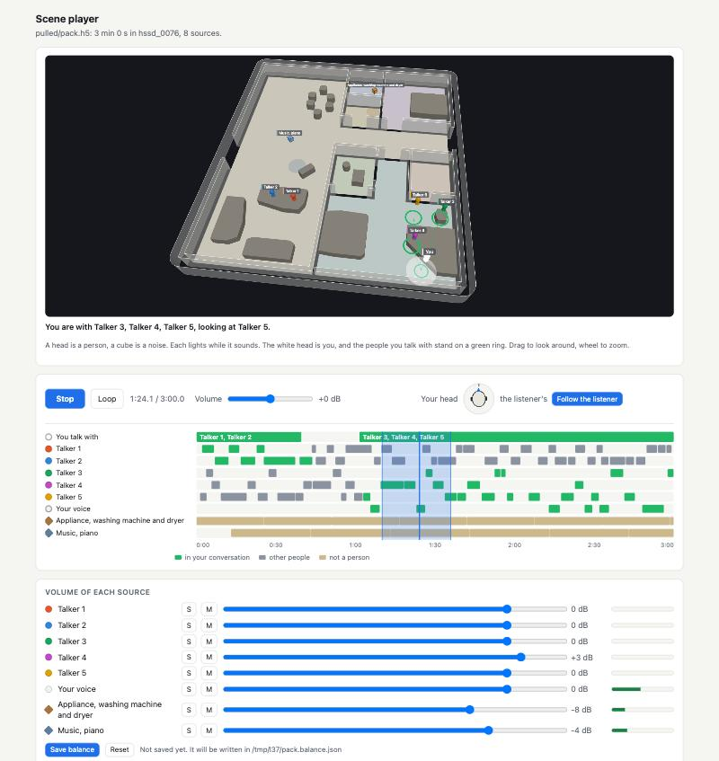
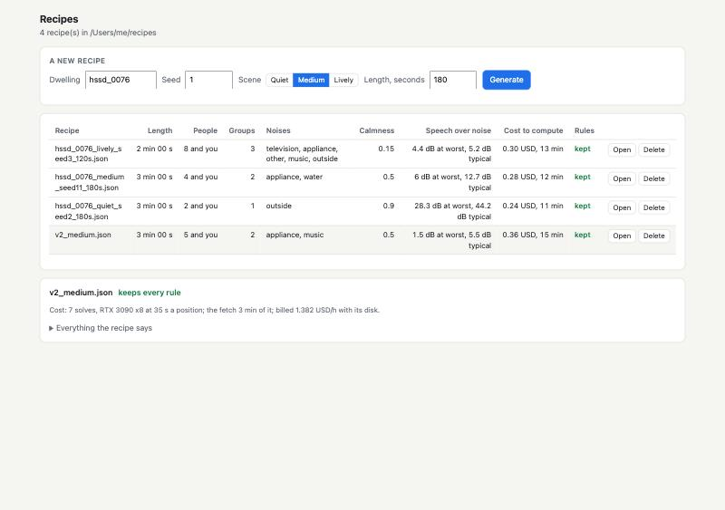
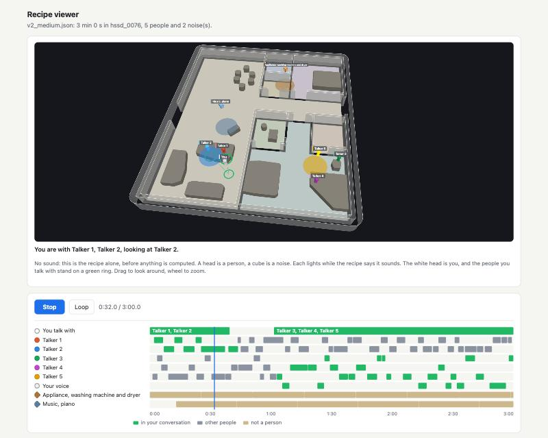
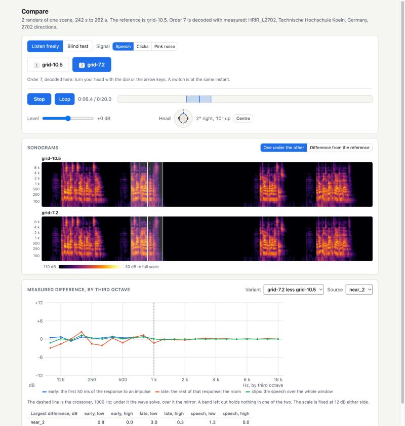
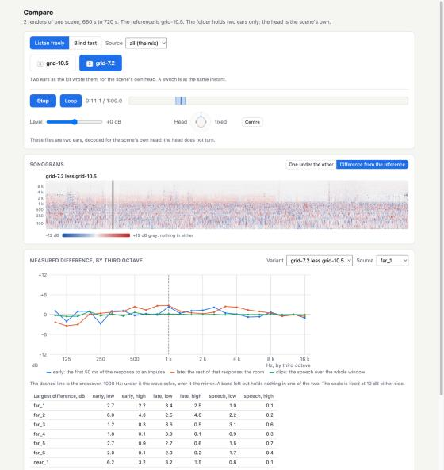
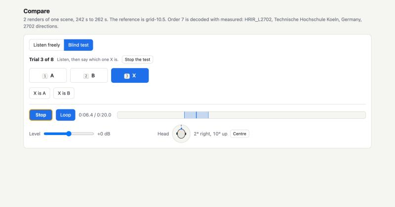
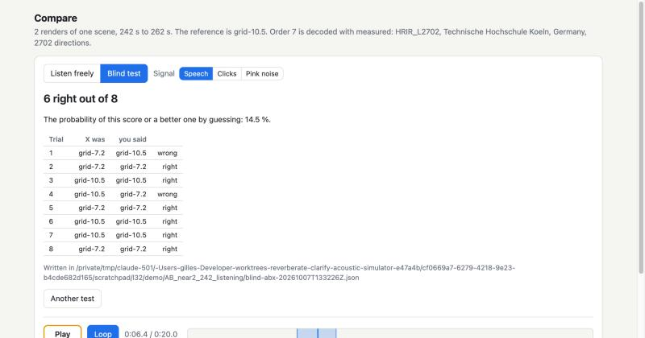

# Small applications and their parts

Date: 2026-10-07

One page of `python -m reverberate.viz.serve_room` shows everything a pack
was computed on. It stays as it is: the inspector. A decision taken by ear
wants a page that holds what the decision needs and nothing else, and that
is deleted once the decision is taken. Such a page is a few hundred lines
because its parts exist: `reverberate.viz.parts` (the server's side) and
`reverberate/viz/parts/static/` (the page's side). No build step, no
dependency the inspector does not have.

| application | command | what it is for |
| --- | --- | --- |
| compare | `python -m reverberate.apps.compare FOLDER` | two to N renders of one short scene, by ear, by eye and blind |
| scene player | `python -m reverberate.apps.scene PACK` | a whole scene played from its pack, everybody in sight and a fader on each |
| recipes | `python -m reverberate.apps.recipes [FOLDER]` | the recipes of a folder: listed, one more drawn, one thrown away, one looked at without sound |

Each binds the loopback address, takes `--port` (8780, 8783 and 8784 unless
said, the next free one when taken) and `--no-browser`.

## Scene player



`PACK` is a scene pack (`formats/scene-pack.md`), of a recipe of either
version. The whole scene is played at order 7, each source's stem rendered
by the signal engine as it is asked for. On the screen, and nothing else:

- **the scene**: the dwelling's rooms and walls (the walls drawn low, so
  that the rooms are seen into), the seating, the listener as the white
  head, each person as a head in a colour with a name, turned the way he
  faces, each noise as a cube with its name. Each lights while it sounds,
  by the level of its own stem under its fader; the listener's own voice
  has no head of its own and lights his. The people the listener talks with
  stand on a green ring joined to him by a line, for as long as the recipe
  says so. Under the picture, in words: who he is with and what he looks
  at. Drag to look around, wheel to zoom;
- **Play** (space), **Loop** (`L`), the time, the **Volume**;
- **Your head**, with **Follow the listener**: on, which is how the page
  opens, the head is the listener's of the scene, where he stands and where
  he looks, and the dial shows it; off, the head stays where it was and is
  turned by dragging the dial or with the arrow keys;
- **the timeline**: the first lane says who the listener talks with, then a
  lane a source with its intervals, green while of the listener's
  conversation (his own voice too), grey for anybody else, sand for what is
  not a person; a word thrown in and a laugh are half as high as a turn. A
  click moves, a drag sets the region the loop turns in, a double click
  clears it;
- **the volume of each source**: a solo (`S`), a mute (`M`), a fader from
  -60 dB, where the source is silent, to +12 dB (a double click puts it
  back at 0), and its meter; **Save balance** and **Reset**.

What it needs beyond the pack: the dry clips the recipe names (`--clips`,
`<data root>/clips`), the measured head (`walk.toml`'s), and, for the walls,
the dataset (`--hssd-root`). Without the dataset the floor is drawn where
the low band was solved and no wall is.

### The balance

Moving a fader is heard at once and written nowhere. **Save balance**
writes `pack.balance.json` beside `pack.h5` (`--balance` to write
elsewhere), and the page says whether what is heard is what the file
holds. The file is the track list's (`reverberate.apps.balance`, under "The
track list"), with what the generator's level table reads in `context`:

| key | meaning |
| --- | --- |
| `context.pack`, `recipe_sha256`, `dwelling`, `duration_s` | what the balance was set on |
| `context.levels.<source>.kind`, `subtype`, `label` | what the source is: the recipe's kind and subtype, and the name on the screen |
| `…recipe_gain_db`, `recipe_level_spl_1m_db` | what the recipe gave it: its gain, and its level at 1 m in free field (version 2) |
| `…fader_db`, `silent` | what the listener set; `silent` when muted, at the bottom of the fader or left out by a solo |
| `…set_level_spl_1m_db` | the recipe's level plus the fader: the level the listener would have given the source. `null` for a silent source, which says nothing of a level, and where the recipe says none |

A generator that learns from it draws a class's level towards the
`set_level_spl_1m_db` of the sources of that `kind` and `subtype` over the
balances saved.

### What it costs to listen

Measured on the laptop (ten cores, 32 GB), on the first pack of a version 2
recipe (three minutes, five talkers, the wearer's own voice, two noises):

| | |
| --- | --- |
| from the command to the page being served, on an empty cache | 2.8 s |
| the first half second of every source rendered | 5.1 s after the command |
| the first 8 s rendered | 7.6 s after the command |
| from Play to sound, where the stems are rendered | 0.08 to 0.17 s |
| from Play to sound after a move to a place never rendered | 0.6 to 0.8 s |
| played against the clock, 20 s at a time | 0.999 to 1.001 s a second, the stream never short |
| the render while it plays | one core on average, four for the second after a move |
| memory | 0.6 to 0.9 GB a worker, 3.1 GB for the four; 0.3 GB the server |
| disk | 50 MB a second listened to: 9.0 GB for the three minutes whole, and 0.7 GB of the sources' noise |

The render is the audit's (`viz/audit_stems.py`): four processes at most,
each 10 nicer than the server, which render from what is heard to 8 s
after it (`--ahead`) and stop; nothing is rendered behind the listener's
back, and nothing at all 20 s after the last request. The stems are kept in
`<data root>/cache/scene_player` (`--cache`) under a key that is everything
their bytes depend on, so a second listen renders nothing; at start, the
scenes opened longest ago are forgotten until the folder is under 12 GB
(`--cache-gb`).

## Recipes



`FOLDER` is where recipes are looked for and written, `<data root>/recipes`
unless said. On the screen:

- **a new recipe**: the **Dwelling**, a **Seed**, the **Scene** (quiet,
  medium or lively: `SocialParameters.preset`), the **Length** in seconds,
  and **Generate**, which writes
  `<dwelling>_<scene>_seed<seed>_<length>s.json` in the folder. The clips are
  the library's (`scenes/library/clarify_v1.json`); the dwelling's computed
  assets are those of a recipe of that dwelling already in the folder, and
  placeholders where there is none, which the page says: such a recipe is
  looked at, and a trace refuses it;
- **the list**, a line a recipe: its length, the people who talk (and the
  listener's own voice), the groups they talk in, the noises, the calmness,
  the conversation over the noise where the listener stands (the worst turn
  and the median, `scenes.levels.conversation_snr`), what its trace is
  predicted to cost on the machine the first scene was traced on
  (`scenes.cost.predict`), and whether it keeps every rule
  (`scenes.validate`, with the dwelling's floor when the dataset is there).
  A click shows the rules broken and, folded, everything
  `scenes.describe` says;
- **Open**: the viewer, in another tab;
- **Delete**: the recipe is moved to `FOLDER/trash/<UTC time>_<name>`.
  Nothing is ever erased, and what is in the trash is not listed.

### The viewer



The scene player's picture and timeline, with no sound and no pack: where
everybody is, where the listener looks and who is of his conversation are
the recipe's alone (`scenes.kinematics`), and a source lights while the
recipe says it sounds. **Play**, **Loop** and the timeline are all there
is to press. A recipe is judged here before a cent is spent on its trace.

## Compare



`FOLDER` is what `python -m reverberate.render check REF.h5 --against V1.h5
... --out FOLDER` writes (`formats/scene-signal.md`): `variants.json` (or
`ab.json` of two packs), the files of two ears, and with `--ambisonic` each
source's order 7 stem. From packs in one command, order 7 and the three
signals:

```
python -m reverberate.apps.compare --packs REF.h5 V1.h5 --names ref cheap \
    --window 242 262 --sources near_2 --out FOLDER
```

The screen holds:

- **the variants as buttons**, keys `1` to `N`. A press changes the render
  heard at the same instant, the two crossfaded over one block of 10.7 ms
  under the same head;
- **play, stop, loop** (space, `L`), a bar that is clicked to move and
  dragged to set the region the loop turns in, and the level, in dB over
  the default at which a pack's full scale stands for 98 dB SPL;
- **the head**: a dial dragged left and right to turn and up and down to
  tilt, the arrow keys by five degrees, `0` to centre. Order 7 is decoded on
  the page with the measured head (`viz/decoders.py`), under the scene's own
  head turned by what the listener adds: with nothing added it is what the
  kit's files of two ears hold. A folder of two ears alone is played as
  written and says that the head does not turn;
- **the signal**: speech (the recipe's clips), clicks, pink noise, where the
  folder holds them (`--signals`);
- **the sonograms**, one under the other on one time axis or each less the
  reference, on a scale that does not move;
- **what the kit measured**, the variant less the reference by third octave
  on the early and the late part of the response to an impulse and on the
  speech, and the largest of each either side of the crossover;
- **a blind test**.



### The blind test



- **ABX**: A and B are named, X is one of the two, drawn again for each
  trial. The listener hears all three as long as he likes and says which X
  is. Nothing is told after a trial. At the end: the score, and the
  probability of that score or a better one by guessing, the binomial's at
  one half a trial (12 right out of 16 is 3.8 per cent).
- **Ranking**: every variant under a name that says nothing, drawn again for
  each trial, put in the order preferred. At the end: how often each came
  first, its mean rank, and the probability that some variant comes first
  that often when the order is chance (one variant's, `1 / N` a trial, times
  the number of variants).

The key stays on the server: the page asks for `blind:X` and is never told
what it stands for; the sonograms are refused while a test runs and the
page hides what was measured. A test is written when its last trial is
answered, or when it is stopped, in `<FOLDER>_listening/blind-<kind>-<UTC
time>.json` (`--results` to write elsewhere):

| key | meaning |
| --- | --- |
| `schema`, `kind` | `"reverberate.apps.blind"`, `"abx"` or `"rank"` |
| `started`, `finished`, `complete`, `trials_planned` | when, and whether every trial was answered |
| `seed` | what the draws were made from: the same seed draws the same test |
| `items` | each variant's name and the item played for it |
| `context` | the folder, the recipe's identity, the window, the signal, the source, the level and the loop's region |
| `trials` | ABX: `x`, `answer`, `right`, `seconds`; ranking: `shown` (hidden name to variant), `ranking` (the preferred first), `seconds` |
| `result` | ABX: `answered`, `right`, `chance`; ranking: `first`, `mean_rank`, `chance` |



## The parts

Each is used alone. The page's side are ES modules served under `parts/`;
the inspector's decoder is served under `reuse/` and is not copied.

### The server (`viz/parts/server.py`)

```python
server = AppServer("mine", Path(__file__).parent / "static")
server.route("GET", "api/thing", lambda request: {"said": request.query.get("q")})
mount_decoders(server, scratch / "decoders", measured_head=None)
server.serve(8790)
```

A route answers what `json.dumps` takes, or a `Binary`; it raises
`HttpError` to refuse. `AppServer.handle(method, url, body)` answers with
no socket, which is how `tests/test_apps_parts.py` asks. A folder serves
nothing above itself.

### What is played (`viz/parts/media.py`, `routes.py`)

An **item** is one thing heard from its start to its end, made of **stems**
that are summed: order 7 signals (`formats/scene-signal.md`) or files of two
ears. `kit_folder(FOLDER)` reads a comparison into items, held to one length
where they are switched; `Library(items)` holds any others. `Media(library,
results).mount(server)` gives the page:

| route | answer |
| --- | --- |
| `GET api/items` | what there is to play |
| `GET api/frames?item=&start=&count=[&balance=]` | float32 `[frame][channel]`, the stems summed in float64 under a balance; one stem at a gain of one is its own samples |
| `GET api/sonogram?item=[&less=]` | float32 `[column][band]`, described in the `X-Sonogram` header |
| `GET api/levels?item=` | each stem's level every 50 ms |
| `GET`, `POST api/balance` | the track list's faders |
| `GET api/blind`, `POST api/blind/start`, `answer`, `stop` | the blind test |

### The player (`static/player.js`, `transport.js`)

```js
const player = createPlayer();
createTransport(element, player);      // the buttons, the bar, the level, the head's dial
await player.load(items);              // rows of api/items, of one length
player.setSceneHead(head);             // the scene's own head, or nothing
player.play(); player.select(items[1].id); player.turn({ yaw: 30 });
```

The audio thread is the inspector's worklet and the filters are turned by
its `rotateSpectra`; two ears go through the same thread with filters that
change nothing. `player.output()` is the node the two ears leave by.
`player.setFollowing(false)` frees the head from the scene's: it stays
where it was and `turn` then sets it in the scene's frame.

`createTransport(element, player, { bar, level, head, follow })` leaves out
what a page has no use for, and with `follow` gives the head its switch.
`createClock(seconds)` (`static/clock.js`) has a player's manners and no
sound, for a page on which nothing is heard.

### A scene from its pack (`viz/parts/stems.py`)

`Streamed(pack, cache)` stands where a `Library` stands, with one item, the
scene, whose stems are the pack's sources: a request for frames waits for
the chunks it covers, which the engine renders then. `levels(from, to)`
gives each stem's level a step of the pack, `None` where nothing is
rendered yet; `trim(cache, budget_gb=)` forgets the scenes opened longest
ago.

### The sonogram (`viz/parts/sonogram.py`, `static/sonogram.js`)

A column every 10 ms, twelve bands an octave from 50 Hz to 16 kHz, of the
omnidirectional channel (or of the mean of two ears) at the page's level. A
cell is a mean square in dB re full scale: a sine of full scale reads -3 dB
in its band whatever else sounds. The colours run from -110 to -30 dB, and a
difference from -12 to +12 dB with grey where neither holds anything (60 dB
under the loudest cell of the two). `createSonogram(element, { player })`
draws them; a click moves the player and a drag sets its loop.

### The track list (`viz/parts/balance.py`, `static/track-list.js`)

A solo, a mute and a fader a source (-60 dB, where it is silent, to +12 dB),
its meter and its level over the window. Every change is saved at once in
`<FOLDER>_listening/balance.json` and the player asks its frames under it,
so the mix heard is the one the file holds; "Export" downloads the same
document. `balance.gains` is the one place a balance becomes factors.
`createTrackList(element, { save: true, lanes: false })` is the scene
player's: the file is written by "Save balance" (`Media(...,
autosave=False)`, `POST api/balance/save`) and no lane is drawn, the page
having a timeline. `Media(..., tracks=)` gives each source the name and the
colour the application knows it by.

| key | meaning |
| --- | --- |
| `schema`, `saved`, `context` | `"reverberate.apps.balance"`, when, and what it was set on |
| `sources` | for each source `gain_db`, `mute`, `solo` |
| `gains` | the factor each source's stem was multiplied by |

### The scene (`viz/parts/scene.py`, `static/scene-view.js`, `timeline.js`)

`pack_scene(pack, plan)` and `recipe_scene(recipe, plan)` give one
document: where the listener and each source are, a value every 0.1 s (the
pack's own tables, or the recipe's kinematics), and who is what, which is
`cast(recipe)`: each source's name in words, its shape (a head, a marker, or
the listener's own voice), its colour, its intervals with what each is to
the listener (`conversation`, `outside`, `noise`), the spans of the
listener's conversation with their members, and what he looks at.
`plan_of(layout)` is the dwelling: the rooms' outlines, the walkable floor
whose boundary is the walls, the seating, the data the inspector's scene
view draws (`viz.scene_api.layout_payload`). `head_track(pack)` is the
scene's own head for `player.setSceneHead`.

`createSceneView(element, scene, { gainOf, lit })` draws it; each source
lights by its own stem's level under its fader, dark at -80 dB and full at
-45 dB, or with `lit: "intervals"` while the recipe says it sounds.
`createTimeline(element, scene, player)` draws the lanes and moves the
player.

### Numbers by third octave (`static/bands.js`)

`drawBands(element, { bandsHz, series, rangeDb, markHz })`: a line a series
on a logarithmic axis and a scale that does not follow the data.

## What remains

- The generator does not read a balance yet: the file's shape is fixed
  here, the level table that learns from it is the generator's to write.
- A chunk in which a source has just stopped holds what is left of its
  filters, down to 1e-28 of full scale, and is written whole (6.1 MB) where
  a chunk of zeros is not: 43 of the 1984 chunks of the first pack's first
  two minutes. The rule that a stem is the engine's bytes is the audit's,
  and is left as it is.
- The manager draws with a preset's parameters and no other; a recipe's
  parameters are read in "Everything the recipe says".
- The viewer plays at the clock's speed; a recipe of twenty minutes is
  looked at by moving along its timeline.

## Writing another

A package under `reverberate/apps/` with a `static/` folder: build an
`AppServer`, mount a `Media` on what is played, add the routes the purpose
needs, and join the parts in one module of the page. `apps/scene` is the
example: 180 lines of Python and 80 of JavaScript.
